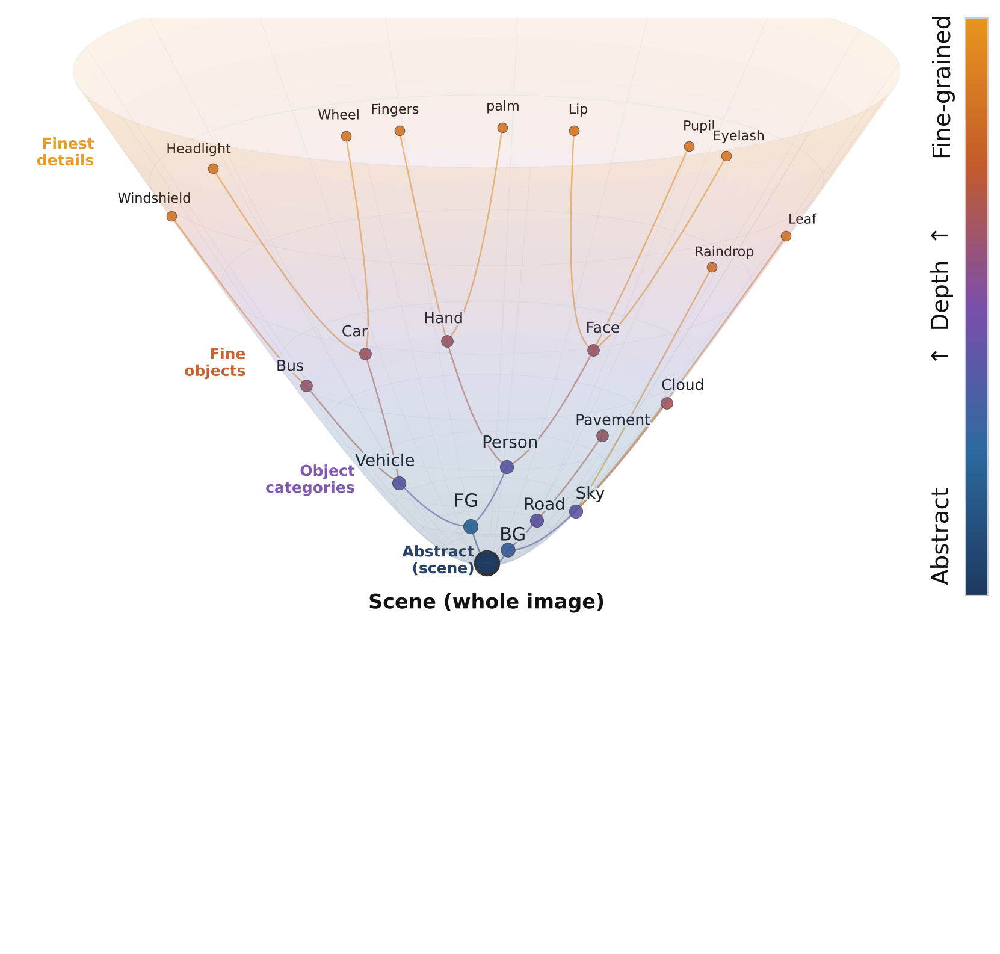
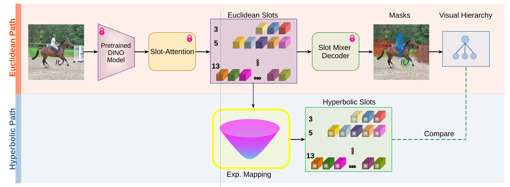

# A Hyperbolic Perspective on Hierarchical Structure in Object-Centric Scene Representations

[Neelu Madan](https://github.com/NeeluMadan) · Àlex Pujol · Andreas Møgelmose · Sergio Escalera · Kamal Nasrollahi · Graham W. Taylor · Thomas B. Moeslund

*Aalborg University · University of Barcelona · Centre de Visió per Computador · Milestone Systems · Pioneer Centre for AI · University of Guelph · Vector Institute*

---

## Overview

This repository contains the code and models for our post-hoc pipeline that projects Euclidean slot representations onto the **Lorentz hyperboloid** to reveal latent hierarchical structure in object-centric scene representations.

We find that:
- Hyperbolic projection exposes a consistent **coarse-to-fine organisation** among slots that is largely invisible in Euclidean space.
- Coarse slots occupy **greater manifold depth** than fine slots across all models and datasets.
- There is a **curvature–task tradeoff**: low curvature (*c* = 0.2) matches or outperforms Euclidean on parent slot retrieval, while moderate curvature (*c* = 0.5) achieves better inter-level separation.

<p align="center">
  
</p>

---

## Method

Our pipeline is fully **post-hoc** — no modification to the original training is required.

1. **Extract** patch-level features using a frozen DINOv2 backbone.
2. **Run slot attention** at five granularity levels *N* ∈ {3, 5, 7, 11, 13}.
3. **Build a visual hierarchy** from slot attention masks via mask inclusion scores.
4. **Project** Euclidean slot embeddings onto the Lorentz hyperboloid via the exponential map at curvature *c* ∈ {0.2, 0.5, 1.0}.
5. **Analyse** whether hyperbolic distances better reflect parent–child structure than Euclidean cosine distances.

<p align="center">
  
</p>

---

## Installation

```bash
git clone https://github.com/NeeluMadan/HHS.git
cd HHS
pip install -r requirements.txt
```

**Requirements:** Python 3.8+, PyTorch, DINOv2 (ViT backbone).

---

## Pretrained Models

We validate our pipeline on three object-centric learning baselines:

| Model | Domain | Dataset | Backbone |
|---|---|---|---|
| [SlotContrast](https://github.com/YorkUCVIL/SlotContrast) | Video | YTVIS 2021 | DINOv2 |
| VideoSAURv2 | Video | YTVIS 2021 | DINOv2 |
| [SPOT](https://github.com/gkakogeorgiou/spot) | Image | MS-COCO | DINOv2 |

> Note: We use a VideoSAUR variant retrained with DINOv2 features for consistency across baselines.


## Results

### Parent Slot Retrieval (Hit@1 ↑)

| Model | Manifold | 3→5 | 5→7 | 7→11 | 11→13 |
|---|---|---|---|---|---|
| SlotContrast | Euclidean | 77.2 | 79.7 | **72.4** | **70.5** |
| | H(*c*=0.2) | **77.8** | **79.9** | 71.8 | 70.2 |
| | H(*c*=0.5) | 77.2 | 78.8 | 71.1 | 69.9 |
| | H(*c*=1.0) | 76.1 | 77.4 | 69.3 | 68.7 |
| VideoSAURv2 | Euclidean | 91.5 | 93.2 | **88.6** | **88.1** |
| | H(*c*=0.2) | **91.9** | **93.3** | 88.5 | **88.1** |
| | H(*c*=0.5) | 91.3 | 92.8 | 88.5 | **88.1** |
| | H(*c*=1.0) | 90.8 | 92.4 | 87.8 | 88.0 |

### Level Separation (Overlap Score OV ↓)

| Model | Euclidean | *c*=0.2 | *c*=0.5 | *c*=1.0 |
|---|---|---|---|---|
| SlotContrast | 0.49 | 0.41 | **0.38** | 0.38 |
| VideoSAURv2 | 0.62 | 0.37 | **0.36** | 0.36 |
| SPOT | 0.51 | 0.36 | **0.35** | 0.35 |

---

## Citation

```bibtex
@inproceedings{madan2026hyperbolic,
  title     = {A Hyperbolic Perspective on Hierarchical Structure in Object-Centric Scene Representations},
  author    = {Madan, Neelu and Pujol, \`{A}lex and M{\o}gelmose, Andreas and Escalera, Sergio and Nasrollahi, Kamal and Taylor, Graham W. and Moeslund, Thomas B.},
  booktitle = {arXiv},
  year      = {2026}
}
```

---

## Acknowledgements

This work builds on [SlotContrast](https://github.com/YorkUCVIL/SlotContrast), [VideoSAUR](https://github.com/martius-lab/videosaur), and [SPOT](https://github.com/gkakogeorgiou/spot). We thank the authors for releasing their code and pretrained models.

---

## License

This project is released under the [MIT License](LICENSE).
